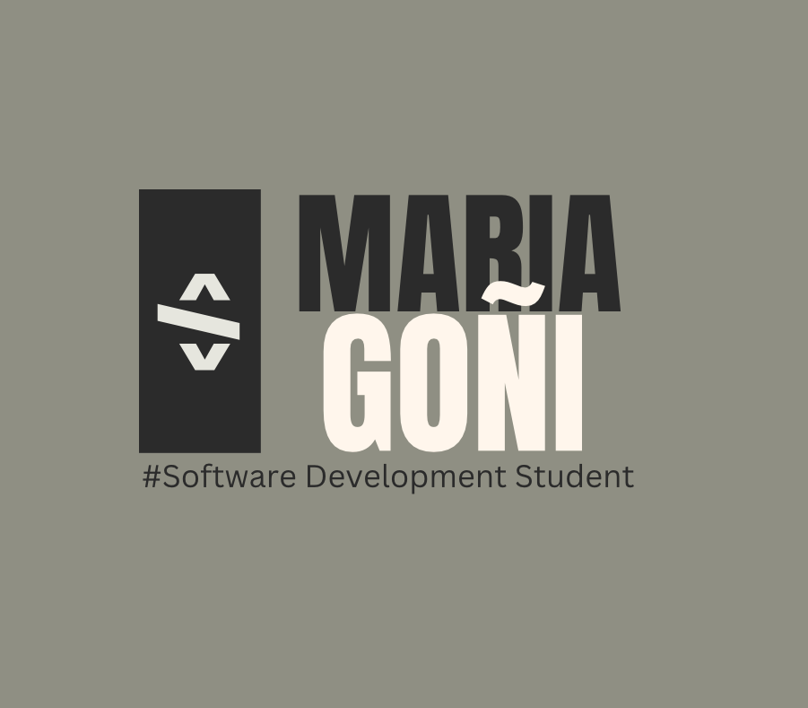

#About me.
- Hi, I’m María Goñi (@MGoni9)
- I'm from Madrid, and I'm currently studying Web Application Development at UAX. 
- I've been interested in programming for years, and I've finally decided to get formal training in it.
- I'm here to learn Python, Java, CSS, PHP, Javascript, and more. 

- Best regards.

<!---
MGoni9/MGoni9 is a ✨ special ✨ repository because its `README.md` (this file) appears on your GitHub profile.
You can click the Preview link to take a look at your changes.
--->
